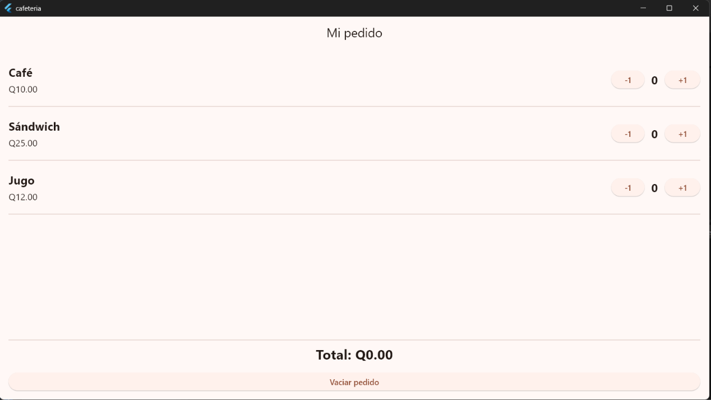
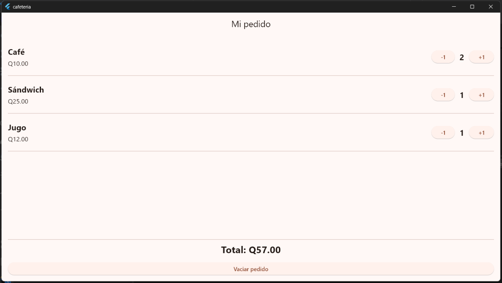
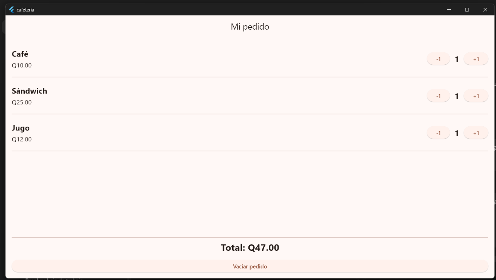
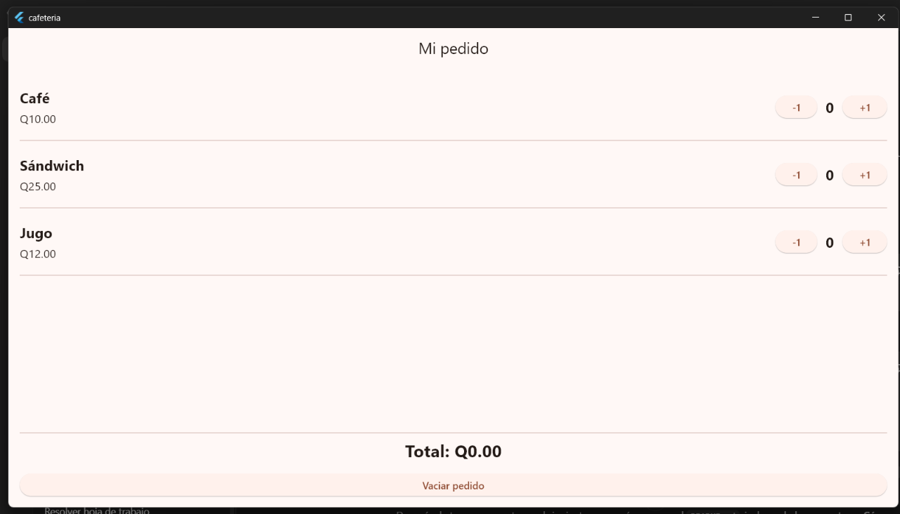

# Laboratorio Cafetería

Aplicación realizada en Flutter para llevar el control de un pedido sencillo de una cafetería.

La aplicación contiene tres productos:

- Café: Q10.00
- Sándwich: Q25.00
- Jugo: Q12.00

Cada producto tiene botones para aumentar o disminuir su cantidad. Las cantidades no pueden ser negativas y el total del pedido se actualiza automáticamente.

## Funcionamiento

### Estado inicial

Al iniciar la aplicación, todos los productos tienen cantidad 0 y el total es Q0.00.

### Pedido de Q57.00

Se agregaron:

- 2 cafés
- 1 sándwich
- 1 jugo

El cálculo es:

- Café: 2 × Q10.00 = Q20.00
- Sándwich: 1 × Q25.00 = Q25.00
- Jugo: 1 × Q12.00 = Q12.00

Total: Q57.00

### Pedido de Q47.00

Se agregó una unidad de cada producto:

- Café: Q10.00
- Sándwich: Q25.00
- Jugo: Q12.00

Total: Q47.00

### Vaciar pedido

El botón `Vaciar pedido` coloca nuevamente todas las cantidades en 0 y el total regresa a Q0.00.

## ¿Cómo calcula el total?

El total se calcula recorriendo los productos y multiplicando el precio de cada producto por su cantidad.

Por ejemplo:

`precio × cantidad`

Después se suman los resultados de los tres productos.

En el código se utiliza la función `calcularTotal()`, y cuando se aumenta o disminuye una cantidad se usa `setState` para actualizar la pantalla y mostrar el nuevo total.

## ¿Por qué conviene reutilizar ProductoPedido?

Conviene utilizar el widget `ProductoPedido` porque los tres productos tienen la misma estructura: nombre, precio, cantidad y botones para aumentar o disminuir.

En lugar de escribir el mismo código tres veces, se crea un solo widget y se reutiliza enviándole diferentes datos por medio de parámetros.

Esto hace que el código sea más ordenado, evita repetir código y facilita realizar cambios en todas las filas.