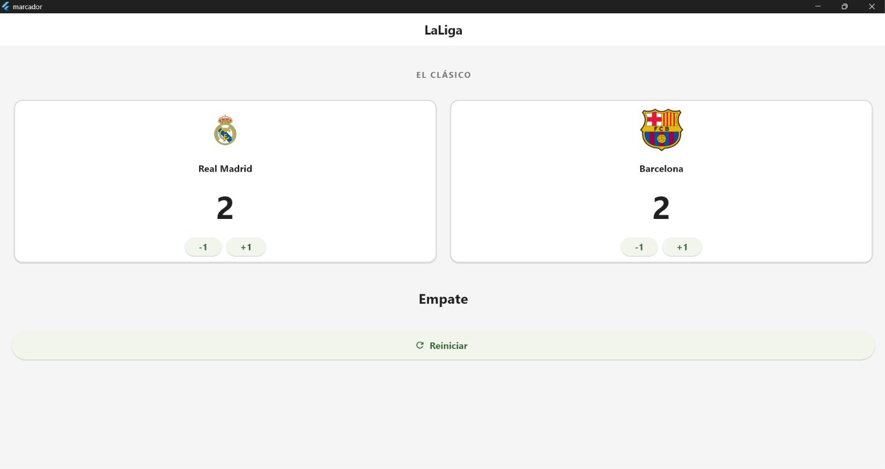
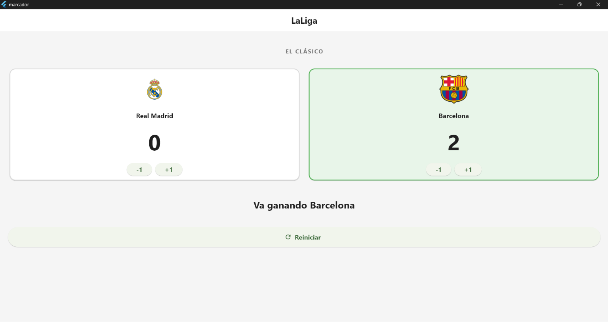

# Laboratorio - Marcador Deportivo

Aplicación desarrollada en Flutter para llevar el marcador entre Real Madrid y Barcelona.

## Capturas de pantalla

### Empate

### Equipo ganador

## Uso de setState

`setState` permite actualizar el estado del marcador y volver a construir la interfaz para mostrar los nuevos puntos.

Si se modifican los puntos sin llamar a `setState`, el valor puede cambiar internamente, pero la pantalla no se actualizará para mostrar el cambio.